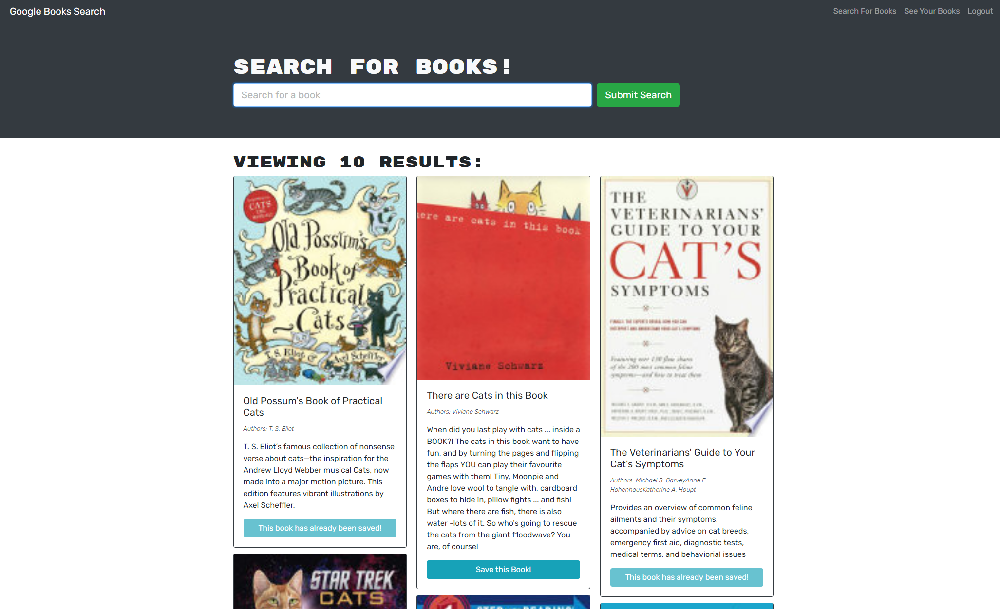
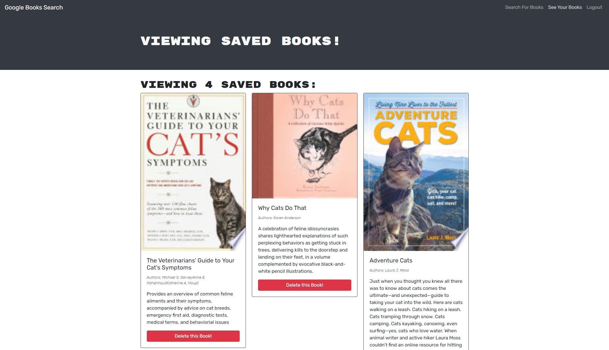

# Tabletop Auction House - React Edition

## Description

Do you love reading? 

This fully functioning Google Books API search engine will help you find new books and save them to your profile. Once you've read or no longer are interested in the books on your profile, you can delete them via your saved books page.

The Google Books API search engine was originally built with a RESTful API and was refactored to run on GraphQL API with Apollo Server. The application was built using the MERN stack with a React front-end, a MongoDB database, and a Node.js/Express.js server and API.

Finding new books has never been easier!

## Table of Contents

* [Description](#description)
* [Installation](#installation)
* [Usage](#usage)
* [Wireframe](#wireframe)
* [Credits](#credits)
* [License](#license)

## Installation

To install the application's dependencies, type the following:
```md
npm install
```
You'll need to host the application on your MongoDB Atlas account.

To run the application locally, type the following:
```md
npm run develop
```

## Usage



A user can search for their favorite books.



The user can save any books they might find interesting.

Navigate to [Google Books Search Engine](https://intense-woodland-01867.herokuapp.com/) and view the web page.

## Credits

Created by [Soma Makela](https://github.com/smakela13).

## License

This website has No License, which means it is under exclusive copyright. No one can copy, distribute, or modify this website without permission.